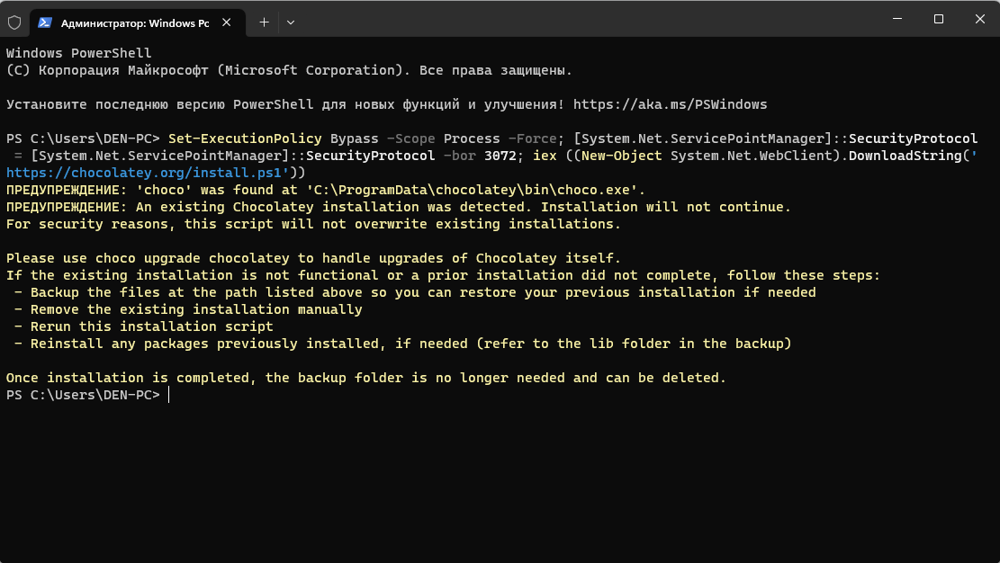
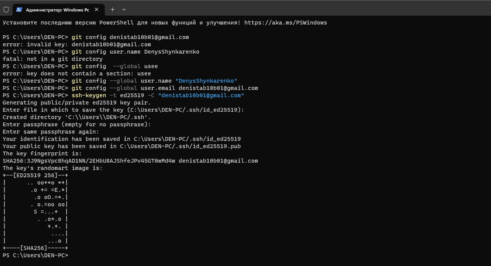
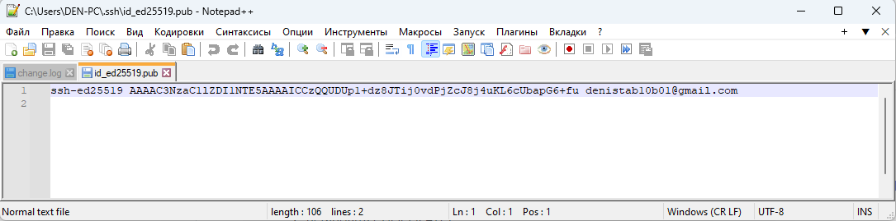
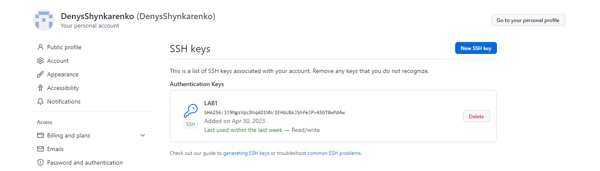
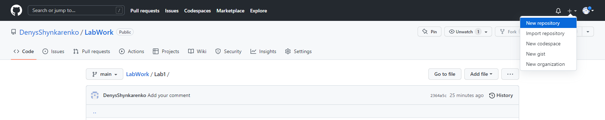
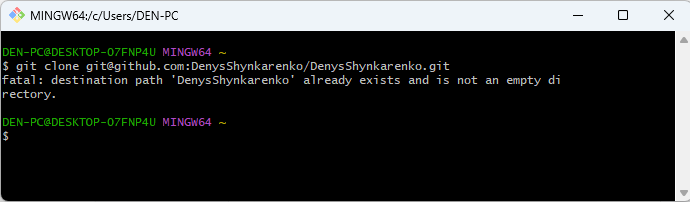
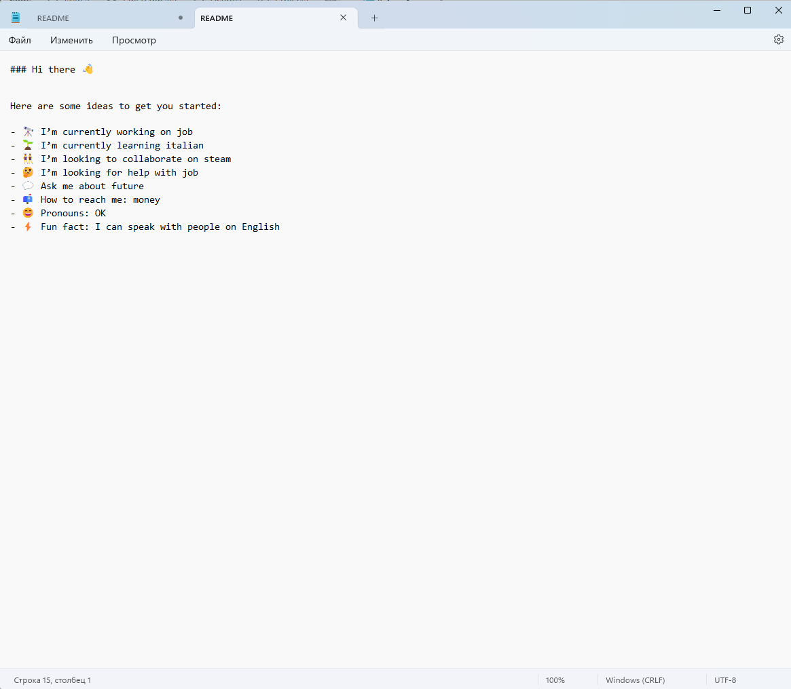
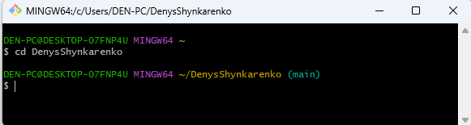
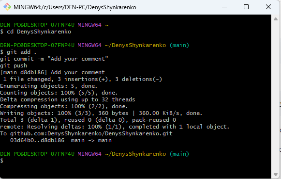
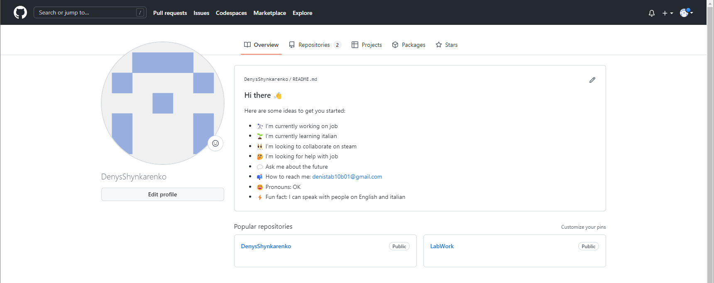

# LabWork

Лабораторная работа 1

Цель работы:

Освоение работы с гитхабом. Базовые команды для работы в нем и создание аккаунта в гитхабе

Выполнение работы:

1. Создаем обліковий запис GitHub

Создадим аккаунт перейдя по ссылке https://github.com/join?ref_cta=Sign+up&ref_loc=header+logged+out&ref_page=%2F&source=header-home

Сама регистрация интуитивна понятная поэтому мы ее подробно расписывать не будем

2. Встановіть CHOCOLATEY

После регестрации нам нужно установить на свой компьютер CHOCOLATEY. В кратце опишим, что такое Chocolatey

Chocolatey — менеджер пакетов с интерфейсом командной строки и установщик программного обеспечения Windows на машинном уровне.
Он использует инфраструктуру упаковки NuGet и Windows PowerShell для упрощения процесса загрузки и установки программного обеспечения.

Теперь нам нужно его установить

Делается это при помощи командной строки запущеной от имени администратора и команды Set-ExecutionPolicy Bypass -Scope Process -Force; [System.Net.ServicePointManager]::SecurityProtocol = [System.Net.ServicePointManager]::SecurityProtocol -bor 3072; iex ((New-Object System.Net.WebClient).DownloadString('https://chocolatey.org/install.ps1'))

Поскольку мы уже установили CHOCOLATEY на свой компьютер, то повторно нам его не нужно ставить 

3. Встановіть git на ваш комп'ютер за допомогою Chocolatey:

Для этого введем следующию команду:

choco install git -y

Поскольку гит у нас уже установлен идем дальше

4. Налаштуйте свій git:

Теперь нам нужно установить имя пользователя и адрес электронной почты 

git config --global user.name "DenysShynkarenko"
git config --global user.email denistab10b01@gmail.com

5. Згенеруйте новий SSH ключ:

Создадим SSH ключ с помощью следующей команды

ssh-keygen -t ed25519 -C "denistab10b01@gmail.com"

После выполнения этой команды ключ создатся по следующему адресу C:\Users\DEN-PC/.ssh/id_ed25519.pub
Файл обычным блокнотом не открыть поэтому, чтобы его прочитать и скопировать ключ нам нужно установить Notepad ++

6. Додайте ключ до облікового запису Github:

Копируем наш ключ и переходим по ссылке https://github.com/settings/keys

Дальше на сайте находим New SSH key 

Вставляем ключ и нажимаем сохранить

результат выполненой работы

Начиная с этого момента мы уже можем использовать ГИТХАБ

1.Створіть новий репозиторій

Заходим на гитхаб и создаем новый репозиторий 

Назва репозиторію має бути такою самою як наша назва аккаунта и он должен быть публичным с добавлением Readme file

2.Заберіть копію репозиторію на локальний комп'ютер:

После создания нашего репозитория нам нужно создать копию на нашем компьютере 

Заходим в наш созданый репозиторий и нажимаем на Code и копируем следующию ссылку 

Дальше заходим в гитбаш и пишим команду 

git clone git@github.com:DenysShynkarenko/DenysShynkarenko.git

Поскольку мы уже это сделали до этого идем дальше

3. Відкрийте README.md вашим улюбленим текстовим редактором.

После создания папки(клона) с таким же названием как наш ник ищем его по следующему пути C:\Users\DEN-PC\DenysShynkarenko

Открываем файл README.md с помощью блокнота и редактируем его 

Завантажте опис вашого профілю:

После редактирования нашего файла и его сохранения нам нужно его загрузить в гитхаб 
Для начало нам нужно перейти в папку с нашим файлом, делается это при помощи cd

После того как мы перешли в папку с нашим файлом пишим следующие команды 

git add .
git commit -m "Add your comment"
git push

После загрузки нашего файла проверим результат работы 

Выводы:

После проведения лабораторной работы мы научились использовать базовые команды гит, научились пользоваться гитбашем и научились создавать репозитории, а также их клонировать на наш компьютер. Также мы научились добавлять в репозиторий новые файлы, а также их редактировать. Скриншоты были вставленны в блокноте при помощи команды "shift+1"

 

