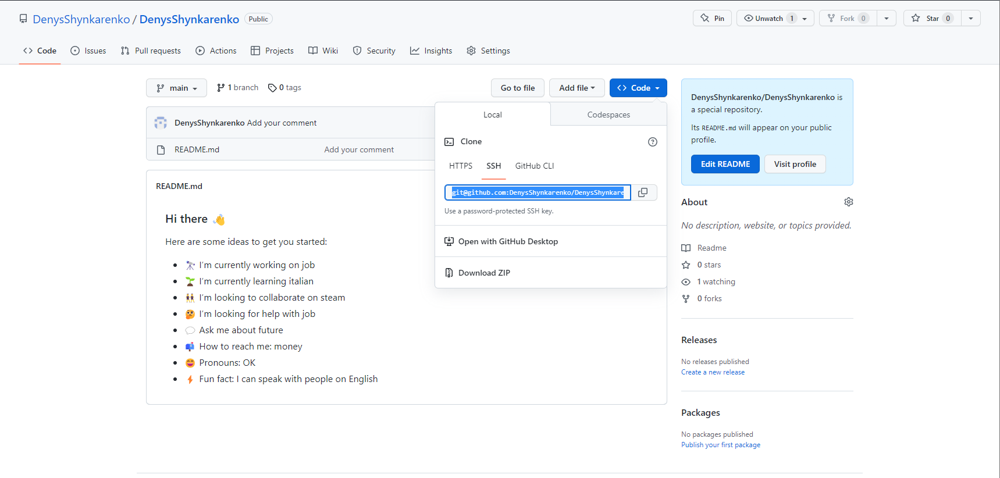

# LabWork

Лабораторна робота 1

Мета роботи:

Освоєння роботи з гітхабом. Базові команди для роботи в ньому і створення аккаунта в гітхабе

Виконання роботи:

1. Створюємо обліковий запис GitHub

Створимо аккаунт перейшовши за посиланням https://github.com/join?ref_cta=Sign+up&ref_loc=header+logged+out&ref_page=%2F&source=header-home

Сама реєстрація інтуїтивна зрозуміла тому ми її детально розписувати не будемо

2. Встановіть CHOCOLATEY

Після реєстрації нам потрібно встановити на свій комп'ютер CHOCOLATEY. У кратце опишемо, що таке Chocolatey

Chocolatey-менеджер пакунків з інтерфейсом командного рядка та інсталятор програмного забезпечення Windows на машинному рівні.
Він використовує інфраструктуру упаковки NuGet та Windows PowerShell для спрощення процесу завантаження та встановлення програмного забезпечення.

Тепер нам потрібно його встановити

Робиться це за допомогою командного рядка запущеної від імені адміністратора і команди Set-ExecutionPolicy Bypass-Scope Process-Force; [System.Net.ServicePointManager]::SecurityProtocol = [System.Net.ServicePointManager]::SecurityProtocol-bor 3072; iex ((New-Object System.Net.WebClient). DownloadString('https://chocolatey.org/install.ps1'))

Оскільки ми вже встановили CHOCOLATEY на свій комп'ютер, то повторно нам його не потрібно ставити

3. Встановіть git на ваш комп'ютер за допомогою Chocolatey:

Для цього введемо наступну команду:

choco install git -y

Оскільки Гіт у нас вже встановлений йдемо далі

4. Налаштуйте свій git:

Тепер нам потрібно встановити ім'я користувача та адресу електронної пошти

git config --global user.name "DenysShynkarenko"
git config --global user.email denistab10b01@gmail.com

5. Згенеруйте новий SSH ключ:

Створимо SSH ключ за допомогою наступної команди

ssh-keygen -t ed25519 -C "denistab10b01@gmail.com"

Після виконання цієї команди ключ створите за наступною адресою C:\Users\DEN-PC/.ssh/id_ed25519.pub
Файл звичайним блокнотом не відкрити тому, щоб його прочитати і скопіювати ключ нам потрібно встановити Notepad ++

6. Додайте ключ до облікового запису Github:

Копіюємо наш ключ і переходимо за посиланням https://github.com/settings/keys

Далі на сайті знаходимо New SSH key

Вставляємо ключ і натискаємо Зберегти

результат виконаної роботи

Починаючи з цього моменту ми вже можемо використовувати ГІТХАБ

1.Створіть новий репозиторій

Заходимо на гітхаб і створюємо новий репозиторій

Назва репозиторію має бути такою самою як наша назва аккаунта і він повинен бути публічним з додаванням Readme file

2.Заберіть копію репозиторію на локальний комп'ютер:

Після створення нашого сховища нам потрібно створити копію на нашому комп'ютері

Заходимо в наш створений репозиторій і натискаємо на Code і копіюємо следующию посилання

Далі заходимо в гітбаш і пишемо команду

git clone git@github.com:DenysShynkarenko/DenysShynkarenko.git

Оскільки ми вже це зробили до цього йдемо далі

3. Відкрийте README.md вашим улюбленим текстовим редактором.

Після створення папки (клону) з такою ж назвою як наш Нік шукаємо його за наступним шляхом C:\Users\DEN-PC\DenysShynkarenko

Відкриваємо файл README.md за допомогою блокнота і редагуємо його

Завантажте опис вашого профілю:

Після редагування нашого файлу та його збереження нам потрібно завантажити його в гітхаб
Для початок нам потрібно перейти в папку з нашим файлом, робиться це за допомогою cd

Після того як ми перейшли в папку з нашим файлом пишемо наступні команди

git add .
git commit -m "Add your comment"
git push

Після завантаження нашого файлу перевіримо результат роботи

Висновок:

Після проведення лабораторної роботи ми навчилися використовувати базові команди Гіт, навчилися користуватися гітбашем і навчилися створювати репозиторії, а також їх клонувати на наш комп'ютер. Також ми навчилися додавати в репозиторій нові файли, а також їх редагувати.

 

