# LabWork

Лабораторна робота 2

Мета роботи

Створити віртуальну машину у GCP за допомогою графічного інтерфейсу і Створити віртуальну машину за допомогою утиліти gcloud

Виконання Роботи

1. Створити GCP аккаунт https://cloud.google.com/

Перейдемо по вище зазначеним посиланням і зайдемо під вже створеним аккаунтом гугл

Після додаткової реєстрації у вигляді вибору для чого ми хочемо використовувати GC ми потрапили на наступну сторінку

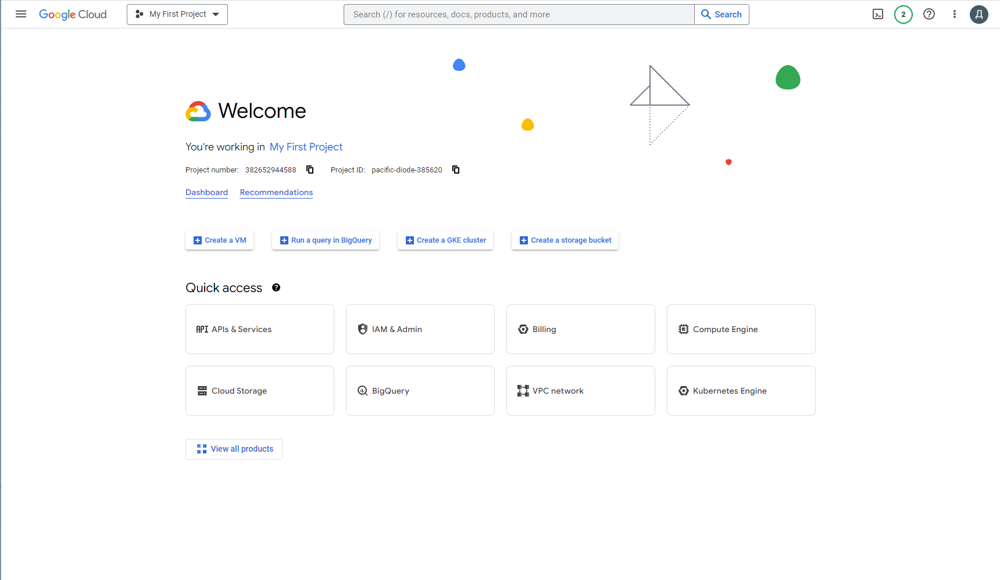

2. Створити проект

Створимо новий проект для цього натискаємо на My First Project, з'являється вікно з вибаром проекту

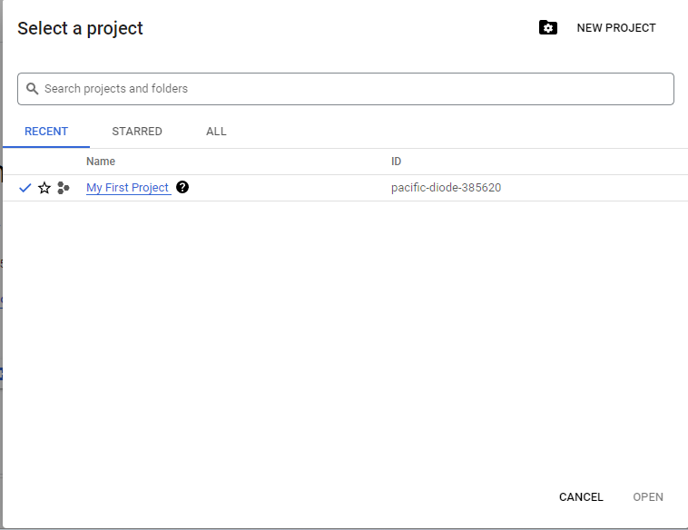

Зверху є кнопка New Project, натиснемо на неї і нам запропонує вибрати назву проетка, назвемо LABA2

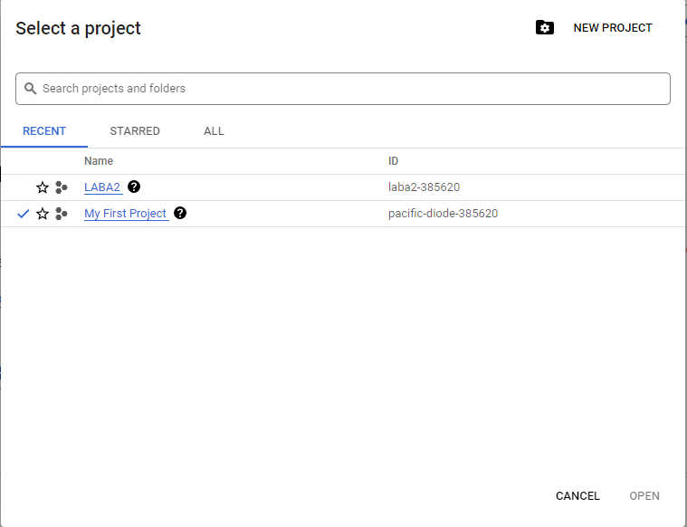

тепер наш проект видно в списку проектів. Вибираємо його

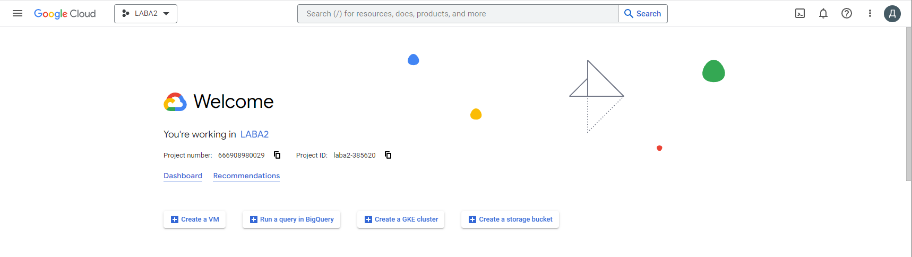

Тепер ми видемо назву нашого проекту і далі ми будемо працювати з ним

3.У проекті створити віртуальну машину використовуючі графічний інтерфейс

Для цього натиснемо Create a VМ і нам пропонують активувати Compute Engine API і ми погоджуємося з цим

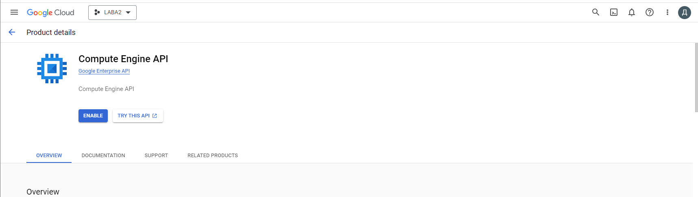

Після завантаження ми можемо створити VM instance

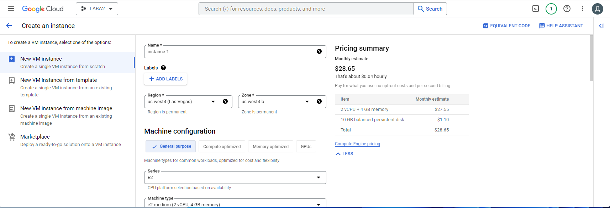

зараз нам доступи функції вибору регіону і конфігурацію віртуальної машини. Залишимо базову конфігурацію віртуальної машини
Натискаємо Створити

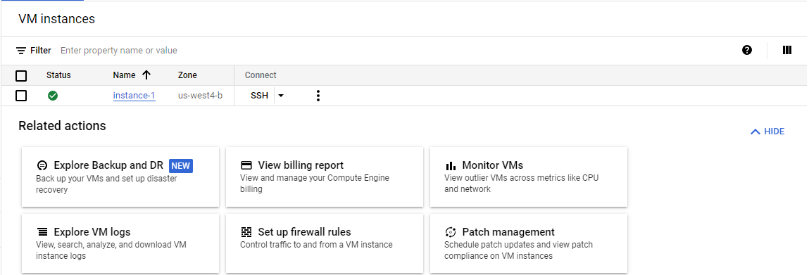

як ми бачимо статус нашої віртуальної машини Активний, а це означає, що ми успішно його створили

4. Створити віртуальну машину за допомогою gcloud.

Для цього використовуємо команду:

gcloud compute images list

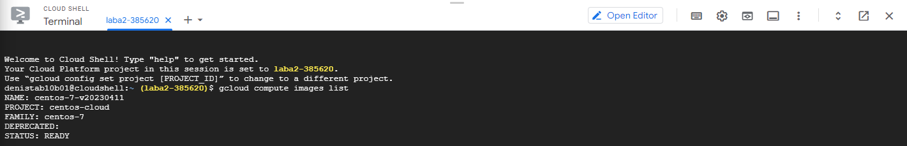

Ми побачимо кілька зображень ОС, виберемо ubuntu
Тепер виконаємо наступну команду

gcloud compute instances create cod-instance --image-family=ubuntu-pro-2004-lts --image-project=ubuntu-os-pro-cloud --machine-type=e2-micro

У консолі з'явився запит у якому ми можемо звернутися регіон. За замовчуванням виставлено europe-west1-з, але нам потрібно зверни теж самий регіон який ми знайшли у попередньому завданні, а саме us-west4-b. Тому на запит консолі відповідаємо n

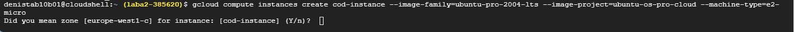

Тепер шукаємо серед на регіон us-west4 - B у списку

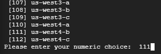

він знаходиться під номером 111, вводимо 111 і натискаємо Ентер

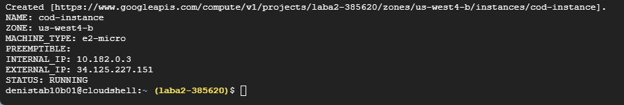

Бачимо, що віртуальна машина успішно створена.

Перейшовши в список наших машин ми можемо побачити, що друга машина успішно створена

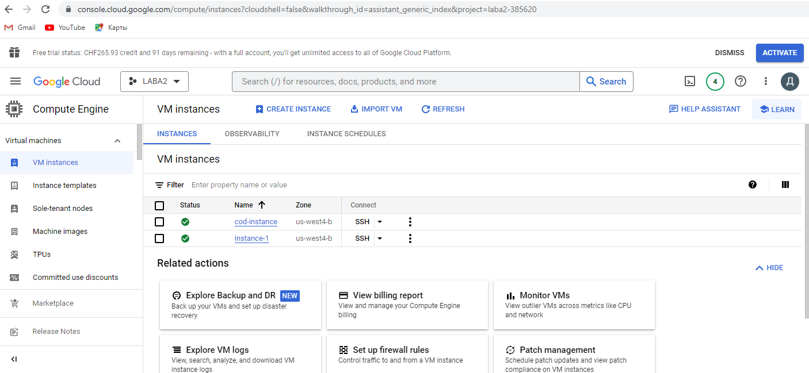

Висновок:

У даній лабораторній роботі ми створили віртуальну машину двома способами. Перший спосіб за допомогою графічного інтерфейсу, особливий плюс варто відзначити, що завдяки графічному интуетивному графічного інтерфейсу користувач може без особливих зусиль створити ВМ оскільки інтерфейс сайту сам підказує, що робити і більшу частину роботи робить за нас. Другий спосіб за допомогою консолі cloud shell і з допомогою утиліти gcloud. Цей способо набагато складніше ніж графічний, але плюс полягає в тому, що можна автоматизувати процес створення ВМ, що робить цей способо більш комерційним.