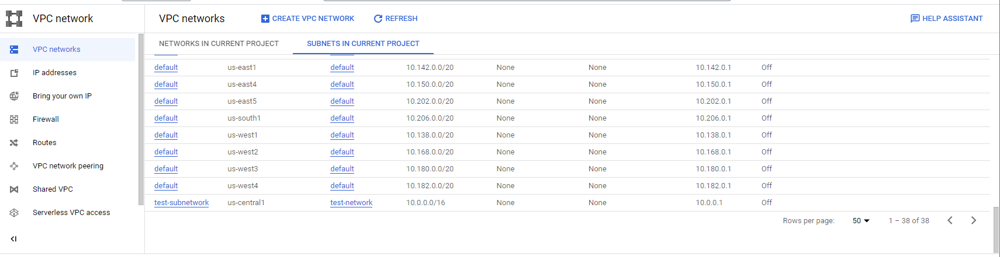
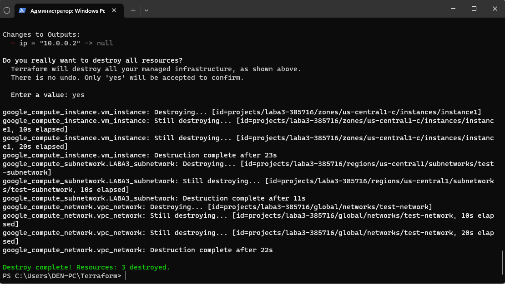
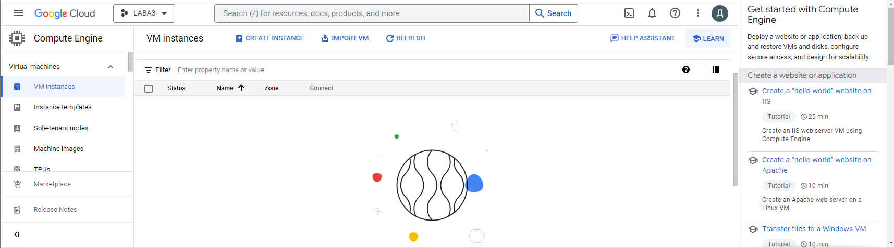

Лабораторна робота 3

Автоматизоване створення проекцій у GCP за допомогою terraform

1. Встановити Terraform

Перше, що ми повинні зробити це встановити terraform на наш комп'ютер і зробимо ми це також як і встановлювали Гіт на наш комп'ютер, через консоль за допомогою команди:
```
choco install terraform
```


Після закінчення інсталяції ми переходимо до GCP і створюємо новий проект під назвою LABA3

2. Створення service account

Після створення нового проекту і активації Compute Engine API переходимо в наш проект і натискаємо IAM and Admin


Після того як ми перейшли по цій вкладці нам потрібно знайти Service Accounts


Натискаємо + CREATE SERVICE ACCOUNT


Даємо ім'я нашого аккаунту і невеликий опис, також пропускаємо не обов'язкові настройки натиснувши DONE


Отримуємо повідомлення про успішно створення аккаунта, а також ми тепер його можемо спостерігати в нашому списку.

Далі нам потрібно створити ключ, щоб terraform міг користуватися нашим аккаунтом і взаємодіяти з GCP. Для цього натиснемо на три точки в стовпчику Actions праворуч від нашого сервіс аккаунта


на відкритій сторінці натискаємо ADD KEY


потім Create new key


і вибираємо формат JSON

Після натискання Create нам на комп'ютер скачався створений нами ключ з назвою нашого проекту.


Також нам потрібно дати роль нашому аккаунту. Для цього повернемося до IAM & Admin і знайдемо розділ IAM


Натискаємо GRANT ACCESS


У New principals записуємо назву нашого сервіс акаунту і нижче обираємо роль Basic / Editor.

3. Налаштування Terraform

Тепер після створення аккаунта нам потрібно створити для Terraform папку в якій будуть зберігається дані туди ж ми і перенесемо наш ключ і створимо файл main.tf

Відкриваємо створений нами файл і запишемо наступний код
```
terraform {
required_providers {
google = {
source = "hashicorp/google"
version = "4.51.0"
}
}
}
```
Тут ми вказуємо terraform, що він повинен працювати в GCP, а далі з сайту hashicorp знаходимо потрібний нам конфіг і вказуємо його в source і вказуємо версію.
```
provider "google" {
credentials = file(var.credentials_file)
project = var.project
region = var.region
zone = var.zone
}
```
Тут ми вказуємо дані необхідні для роботи, ключ, наш проект, регіон та зону. Їх буде записано у файл variables.tf
```
resource "google_compute_network" "vpc_network" {
name = "test-network"
auto_create_subnetworks = false
}
```
Тут ми створюємо в проекті test-network і за допомогою auto_create_subnetworks = false вимикаємо автоматичне створення subnetworks

Далі створимо subnetwork
```
resource "google_compute_subnetwork" "LABA3_subnetwork"{
name = "test-subnetwork"
network = google_compute_network.vpc_network.name
ip_cidr_range = "10.0.0.0/16"
region = var.subnet-region
}
```

Ім'я обрано "test-subnetwork", регіон буде зазначено у файлі "variables.tf". Мережею обираємо раніше створену та вказуємо IP-адресою "10.0.0.0" з маскою підмережі в 16 біт.

Перейдемо до створення віртуальної машини. По-перше задамо ім'я instance1 та конфігурацію машини e2-micro.
```
resource "google_compute_instance" "vm_instance" {
name = "instance1"
machine_type = "e2-micro"
tags = ["edu", "micro", "linux", "devops", "ukraine"]

boot_disk {
initialize_params {
image = "debian-cloud/debian-11"
}
}

network_interface {
network = google_compute_network.vpc_network.name
subnetwork = google_compute_subnetwork.LABA3_subnetwork.name
access_config {
}
}
}
```
У розділі boot_disk оберемо бажаний образ операційної системи (Debian 11). Під network_interface задаємо мережу та сабнетворк, створені раніше.

Перейдемо до файлу "variables.tf"

Запишемо наші дані в цей файл
```
variable "project" {
default = "laba3-385716"
}

variable "credentials_file" {
default = "laba3-385716-d111e44efa9f.json"
}

variable "region" {
default = "us-central1"
}

variable "zone" {
default = "us-central1-c"
}

variable "subnet-region" {
default = "us-central1"
}
```
Тепер запишемо в файл outputs.tf наступну команду
```
output "ip" {
value = google_compute_instance.vm_instance.network_interface.0.network_ip
}
```
Цей код відасть нам IP-адресою машини при виконані terraform apply.

Перейдемо до виконання роботи

Зайшовши в термінал від іменни адміністратора пишемо команду cd і назва нашої папки в якій лежать наші файли, а після пишемо команду
```
terraform init
```
і натискаємо Enter


далі пишемо
```
terraform apply
```


Ми бачимо план, що зробить terraform і нам потрібно підтвердити його дії
Після натискання YES, почнеться створення віртуальної машини


Після успішного створення віртуальної машини, повернемося в GCP і перевіримо наявність нашої машини


Також перевіримо інші створені ресурси




Як можна побачити ВМ ми створили правильно, а також subnetwork із заданими параметрами

Тепер видалимо ВМ за допомогою команди
```
terraform destroy
```
Після введення цієї команди на питання чи згодні ми на видалення пишемо YES



Йдемо на GCP, щоб перевірити наявність ВМ.



Як ми бачимо видалення пройшло успішно, terraform видалив все і нічого не залишив

Висновок:

Ми навчилися використовувати terraform і за допомогою його створили віртуальну машину у GCP, а також мережі. Також навчилися створювати SERVICE ACCOUNT і налаштовувати його. З виконаної роботи ми можемо зробити висновок, що terraform ми можемо іспользвовать для створення хмарної інфраструктури в cloud і управляти нею за допомогою .TF файлів. Це дозволяє нам автоматизувати процес створення потрібних нам процесів наприклад створення віртуальної машини або створення мереж.